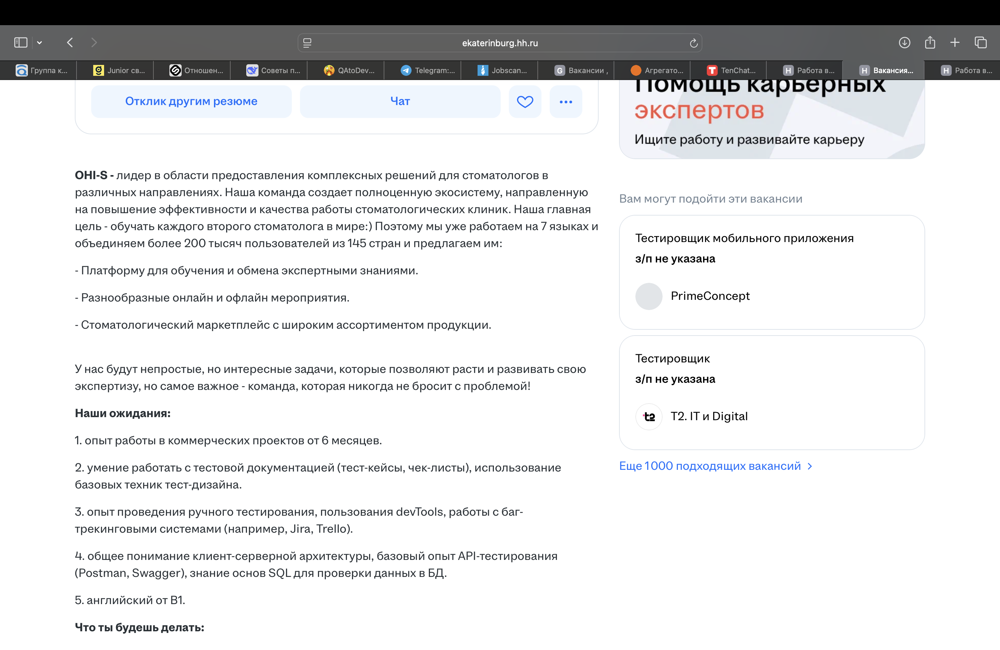

# QA Case Study: Как я нашёл критический баг в форме обратной связи (IT-услуги) И ДАЛЕЕ СТАЛ ДОБАВЛЯТЬ СЮДА БАГИ ИЗ ВАКАНСИЙ

**Цель проекта:** Проведение исследовательского тестирования (Exploratory Testing) и параллельно поиск работы. 

**Стек:** Safari Web Inspector, Screen-to-Gif/Lightshot.

---

## 🐞 Найдено багов на данный момент 3 (1 Critical, 1 Minor, 1 Trivial) в 2 кампаниях

### Кейс №1: Некорректный HTTP-статус при сбое SMTP (False Positive 200 OK)  
**ID:** BUG-001  
**Severity:** Critical  
**Priority:** Высокий

**Описание:** 
Форма обратной связи возвращает 200 OK при фактическом сбое отправки почты (SMTP connection failed)  

**Технические детали:**
- **Ложное срабатывание:** HTTP Response возвращает статус `200 OK`.
- **Тело ответа:** Содержит техническую ошибку: `Sending the email failed : smtp-server-host:25`.
- **Проблема:** Некорректная обработка исключений на бэкенде. Статус `200` вводит пользователя в заблуждение, а компания безвозвратно теряет резюме.

**Шаги воспроизведения:**
1. Заполнить обязательные поля обратной связи всеми валидными данными.
2. Отправить форму с открытой вкладкой Network в DevTools.
3. Проверить тело ответа запроса `sendmail`.

**Ожидаемый результат:**  
При успехе — 200 + уведомление  
При ошибке SMTP — HTTP 5xx + логирование на сервере  

**Фактический результат:**  
200 OK, но в теле — HTML с ошибкой подключения к почтовому серверу  
Пользователь видит «Ошибка отправки», но причина скрыта  

**Окружение:** macOS Safari.

**Влияние:**  
Компания теряет все заявки и резюме, отправленные через форму   
Репутационные потери из-за негативного опыта  
Из-за статуса 200 авто-тесты и системы мониторинга считают, что сервис здоров («зеленый» статус)  

## 🛠 Методология
Методология: Black Box. При обнаружении сбоя отправки формы провёл анализ сетевых запросов (Network Tab) и локализовал проблему на уровне бэкенда (SMTP).

.png)
.png)
---

### Кейс №2: Регрессия верстки на планшетных разрешениях (UI/UX)
**ID:** BUG-002  
**Severity:** Minor  
**Priority:** Средний 

**Описание:** 
Наложение элементов управления слайдером на текстовый контент при ширине вьюпорта 744px (iPad).

**Технические детали:**
- Элемент: `span.carousel-control-next-icon`.
- Причина: Некорректный расчет `z-index` или отсутствие адаптивных отступов (padding/margin) для конкретного брейкпоинта.
- Влияние: Частичная нечитаемость важного маркетингового блока.

**Шаги воспроизведения:**  
1 Открыть главную страницу сайта  
2 Включить инструменты разработчика (Safari Web Inspector)  
3 Переключиться в режим эмуляции устройств (иконка iPad)  
4 Установить ширину вьюпорта 744px  
5 Прокрутить до блока с заголовком «name»  
6 Обратить внимание на правую стрелку слайдера  

**Ожидаемый результат:**  
Кнопка навигации расположена за пределами текстового блока или имеет достаточный отступ, не перекрывая контент.

**Фактический результат:**  
Стрелка накладывается на текст, делая его частично нечитаемым.   
Та же проблема наблюдается и для левой стрелки на всех трёх карточках слайдера.

**Окружение:** macOS Safari.

**Влияние:**  
Визуальный дефект на главной странице IT-компании  
Снижает доверие к качеству продукта  
Ухудшает пользовательский опыт на планшетах

  

### Кейс №3: Грамматическая ошибка в тексте вакансии (UI)
**ID:** BUG-001
**Заголовок:** Грамматическая ошибка в слове «проектов» в первом пункте раздела «Наши ожидания»
**Priority:** Низкий
**Severity:** Тривиальный

**Предусловия:**
1. Открыта страница вакансии «Тестировщик (EdTech) Junior» (ООО КлиентПро).

**Шаги для воспроизведения:**
1. Прокрутить страницу до блока «Наши ожидания».
2. Найти первый пункт списка, содержащий слово «проектов».

**ФР:**
Текст содержит ошибку согласования: «Опыт работы в коммерческих проектов...»

**ОР:**
Текст должен быть грамматически верным: «Опыт работы в коммерческих проектах...»  
**Окружение:**
Устройство: Десктоп, MacOS, Safari  

## 📄 Резюме автора
Данные баги были оформлены в отчет и направлены в профильный отдел компании. Кейс демонстрирует навыки работы с инструментами разработчика, умение приоритизировать баги и локализовать сложные ошибки бэкенда.
