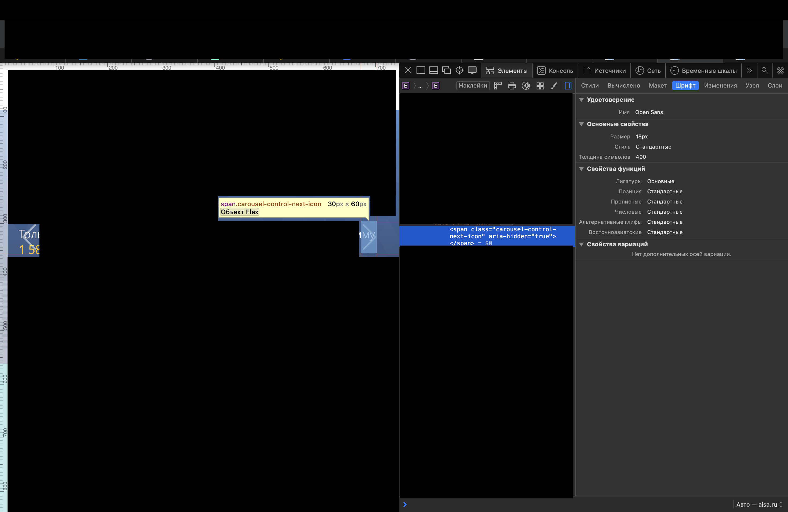

# QA Case Study: Как я нашёл критический баг в форме обратной связи (IT-услуги)

**Цель проекта:** Проведение исследовательского тестирования (Exploratory Testing) корпоративного портала крупной IT-компании. 
**Стек:** Safari Web Inspector, Screen-to-Gif/Lightshot.

---

## 🐞 Найдено багов: 2 (1 Critical, 1 Minor)

### Кейс №1: Критическая ошибка бизнес-логики (Backend/Integration)
**ID:** BUG-001  
**Severity:** Critical  
**Priority:** Высокий

**Описание:** 
Форма возвращает статус 200 OK, но письмо не уходит — SMTP-сервер недоступен. Компания теряет заявки, не зная об этом. 

**Технические детали (Root Cause Analysis):**
- **Ложное срабатывание:** HTTP Response возвращает статус `200 OK`.
- **Тело ответа (Payload):** Содержит техническую ошибку: `Sending the email failed : smtp-server-host:25`.
- **Проблема:** Некорректная обработка исключений на бэкенде. Статус `200` вводит пользователя в заблуждение, а компания безвозвратно теряет резюме.

**Шаги воспроизведения:**
1. Заполнить форму обратной связи всеми валидными данными.
2. Отправить форму с открытой вкладкой Network в DevTools.
3. Проверить тело ответа запроса `sendmail`.

![Описание]
.png)
---

### Кейс №2: Регрессия верстки на планшетных разрешениях (UI/UX)
**ID:** BUG-002  
**Severity:** Minor  
**Priority:** Средний 

**Описание:** 
Наложение элементов управления слайдером на текстовый контент при ширине вьюпорта 744px (iPad portrait).

**Анализ:**
- Элемент: `span.carousel-control-next-icon`.
- Причина: Некорректный расчет `z-index` или отсутствие адаптивных отступов (padding/margin) для конкретного брейкпоинта.
- Влияние: Частичная нечитаемость важного маркетингового блока (блок "BigData").

**Окружение:** macOS Safari.

---

## 🛠 Методология
Методология: Black Box. При обнаружении сбоя отправки формы провёл анализ сетевых запросов (Network Tab) и локализовал проблему на уровне бэкенда (SMTP).

## 📄 Резюме автора
Данные баги были оформлены в отчет и направлены в профильный отдел компании. Кейс демонстрирует навыки работы с инструментами разработчика, умение приоритизировать баги и локализовать сложные ошибки бэкенда.

